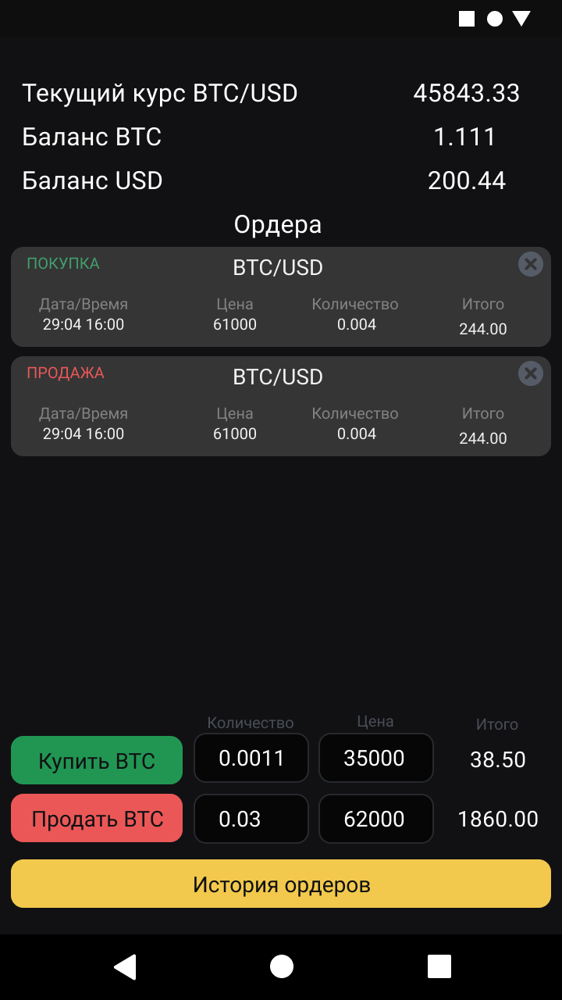

# Crypto Exchange

Учебный проект курса "Разработчик бэкенд на котлин". CryptoExchange это биржа для торговли криптовалютами,
предоставляющая соответствующее клиентское API.

Основной функцинал состоит в

* получении актуальных курсов торговых пар через какой-либо открытый источник (в проекте это одна пара **BTC/USD**)
* выставлении ордеров на покупку/продажу
* отслеживание ордеров и их исполнение
* создание некоего подобия аккаунта пользователя (хранение баланса валют, истоирии ордеров)

### Маркетинговый анализ проекта

Поиск целевой аудитории был проведен следующим образом:

**Шаг 1.** Был проведен поиск сообществ в соцсети "Вконтакте" (то есть среди русскоязычной аудитории) по ключевым словам

- криптовалюта
- bitcoin
- etherium
- биткоин

Сообщества с количеством участников менее 1000 и активностью менее 5% из результата отбрасывались. Это было сделано с
той целью, чтобы отмести "мертвые сообщества"

**_В результате поиск дал 359 сообществ_**

**Шаг 2.** Проведен парсинг пользователей в сообществах и проведена выборка пользователей, которые одновременно состоят
в более чем 2х сообществах, что сигнализирует о том, что в выборку попадут люди, интересующиеся данной тематикой.

**_В выборку попало 1 292 647 пользователей, после отчистки от неактивных и ботов осталось 772 897_**

**Шаг 3.** Как видно из результатов шага 2, аудитория данной тематики весьма обширная, что позволяет составить портрет
аудитории.

Выборка пользователей из шага 2, была разбита на группы по полу, возрасту, интересам. По результатам портрент аудитории
получится следующим:

- Пол -> мужской и женский (М - 60% аудитории, Ж - 40%)
- Возраст -> 20-45 лет (62% аудитории)
- Страны -> Россия, Украина, Беларусь (51%, 20%, 4% соответственно)
- Города -> Москва, Санкт-Петербург, Киев, Минск (14%, 4%, 3%, 1%)
- Профессия -> администратор, менеджер, менеджер по продажам, продавец-консультант, предприниматель
- Университеты -> МГУ, Финансовый университет (бывш. ГУМФ), РАНХиГС при Президенте РФ, Академический Международный
  Институт, Финансовый университет (бывш. ВГНА)

Отсюда делаем вывод, что типичный пользователь приложения это человек в наиболее активной фазе жизни, имеющий высшее
образование или получающий его(преимущественно финансовое, юридическое, управленческое). Неизвестен уровень доходов
потенциального клиента, но судя по перечню профессий он находится около среднего уровня, у отдельного сегмента аудитории
вероятен выше среднего, но из этого можно сделать вывод о том (и это самое важное), что потенциальный клиент верит в
возможности блокчейн-технологий и желает улучщшить свое благосостояние за счет торогвли на криптовалютых биржах.

# MVP

Подразумевается, что клиентом для данного приложения будем мобильное приложение для Android. Примерный внешний вид
представлен ниже

## Эндпоинты

1. **/account/** аккаунт пользователя. Реализует функции:
    1. создать
    2. удалить

2. **/userinfo/** данные пользователя. Реализует функции:
    1. балансы валют текущего пользователя

3. **/order/** ордера пользователя. Реализует функции:
    1. создание ордера
    2. удаление ордера
    3. список ордеров + фильтр (по дате, состоянию, валютной паре, направлению обмена и тд)

4. **/ticker/** курсы торговых пар. Реализует функции
    1. курсы торговых пар
   
5. **/ticker/supported/** Доступные к торговле валютны пары. Реализует функции
   1. список доступных валют

## Транспортные сущности (модели)

1. **UserId** - идентификатор пользователя

2. **CurrencyPair** - валютная пара (тикер + количество)

3. **TickerPair** - пара тикеров валют. Служит, например, для получения обменного курса между указанными парами
   1. first - тикер первой валюты
   2. second - тикер второй валюты

4. **User** - Аккаунт пользователя
    1. UserId - идентификатор пользователя
    2. List\<CurrencyPair> - Список балансов валют.
   
5. **Order** - объект, описывающий ордер на бирже
   1. orderId - Идентификатор ордера 
   2. created - Метка времени создания ордера
   3. orderType - тип ордера (покупка/продажа)
   4. orderState - состояние ордера (активен, завершен, отменен)
   5. TickerPair -  торговая пара, по которой был выставлен ордер
   6. quantity - количество валюты по которой был выставлен ордер   
   7. price - цена в сделке
   8. amount - количество получаемой валюты (amount = price * quantity)

6. **Ticker** - объект, содержащий курс обменной пары
   1. TickerPair - пара, для определения обменного курса
   2. rate - обменный курс между first и second
    
